# Smart Timetable Generator

[](./LICENSE)


A sophisticated, constraint-based academic scheduling system designed to fully automate, validate, and manage university course timetables. It combines a robust FastAPI backend with an elegant React frontend, enforcing complex academic constraints through a custom scheduling engine.

---

## Demo & Screenshots


<details>
<summary>Click to view Screenshots</summary>

### Login
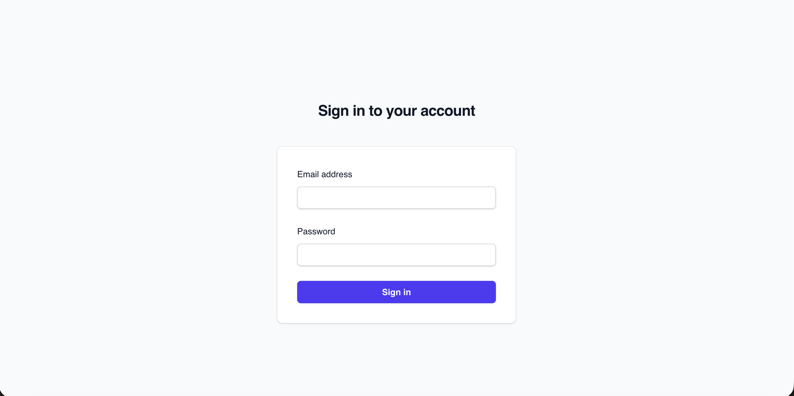

### Dashboard & Navigation
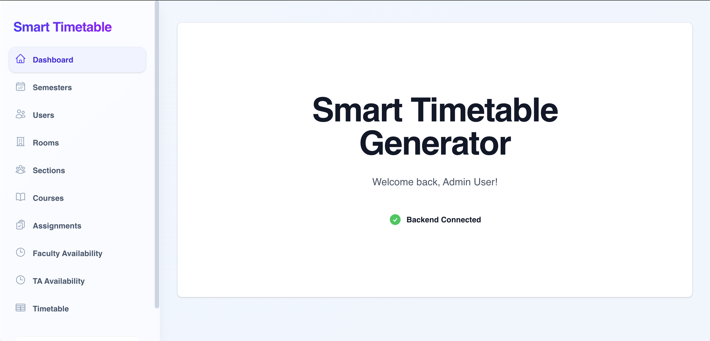

### Semester Management
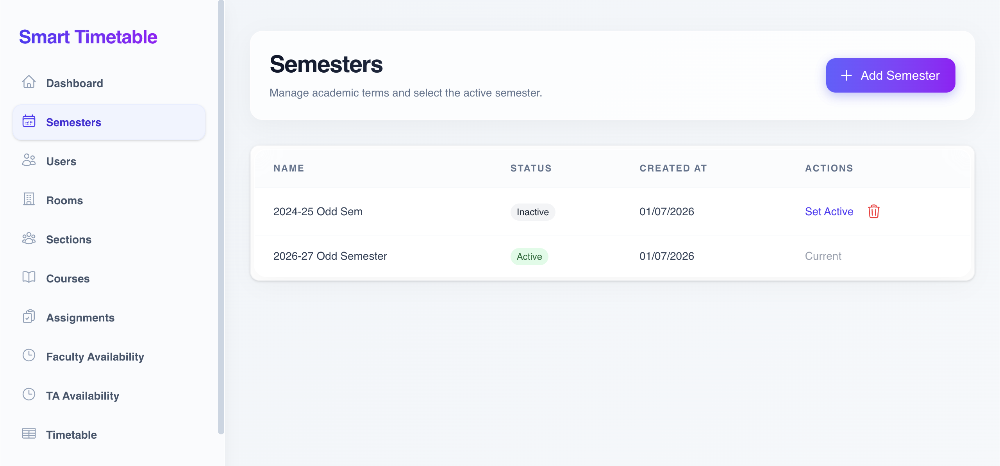
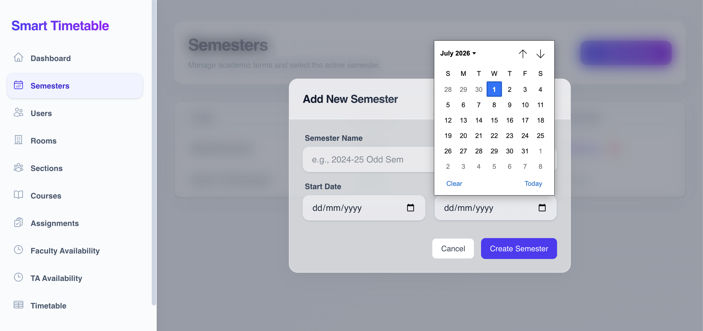

### Users Management
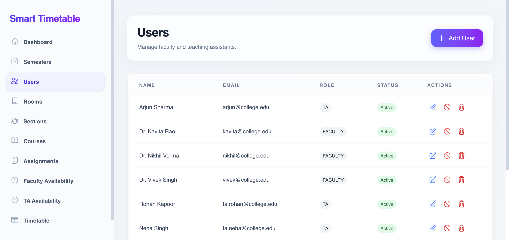
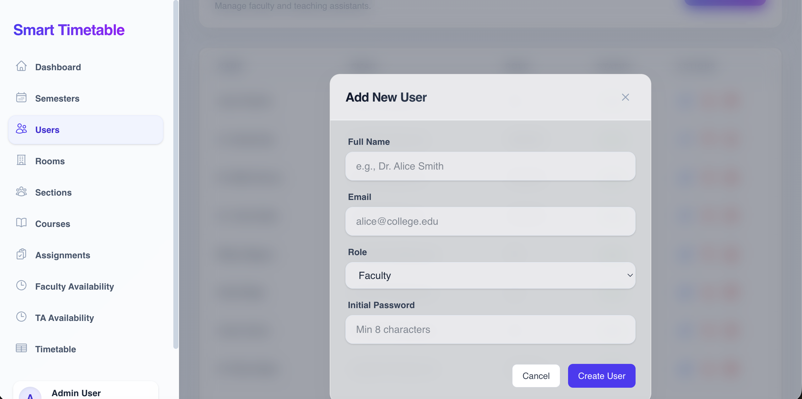

### Room Management
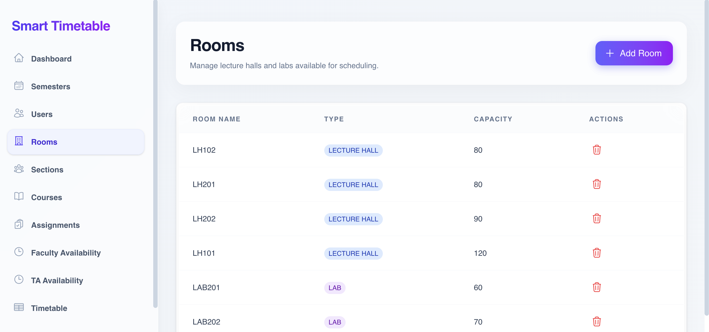
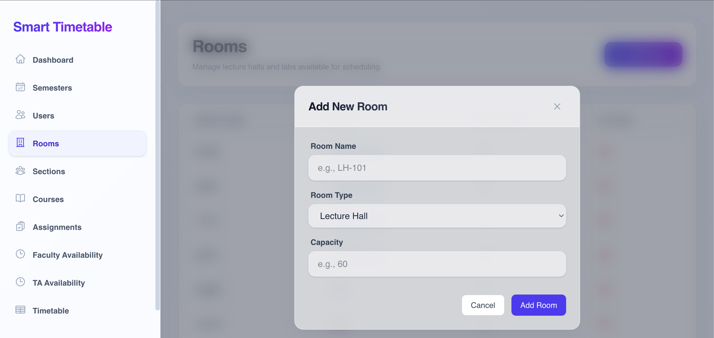

### Sections Management
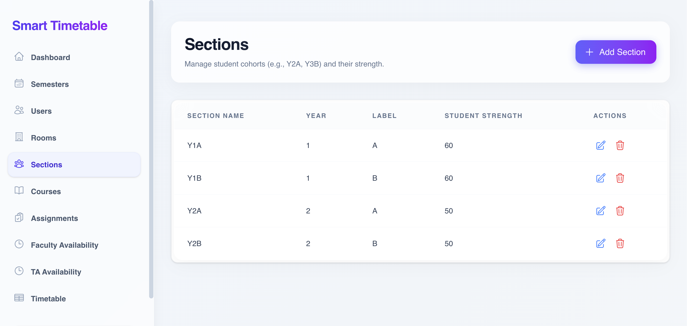
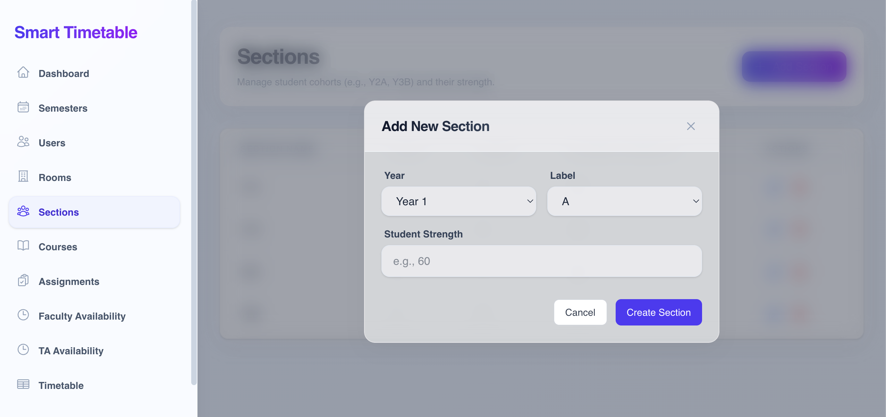

### Course Management
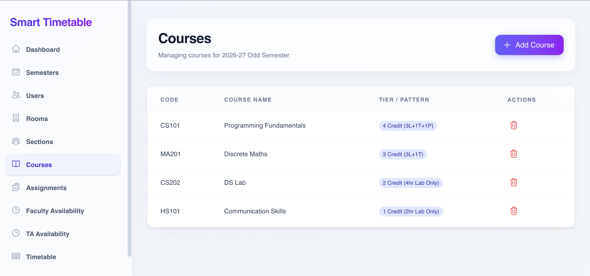
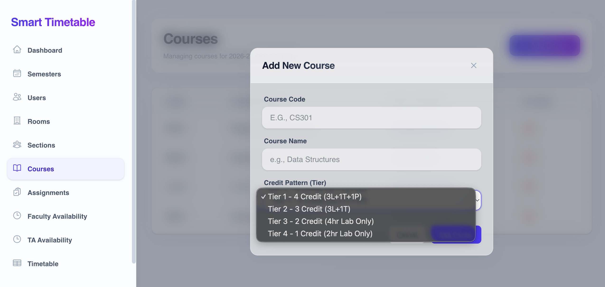

### Course Assignment
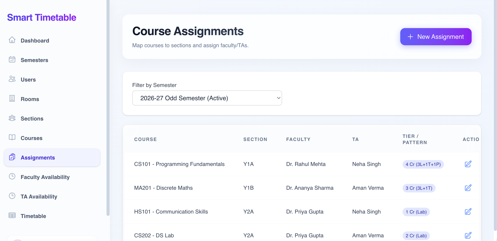
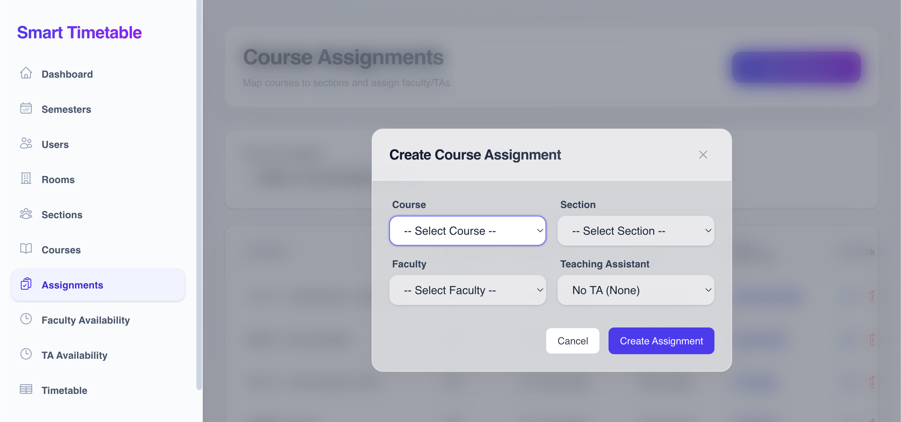

### Faculty/TA Unavailability
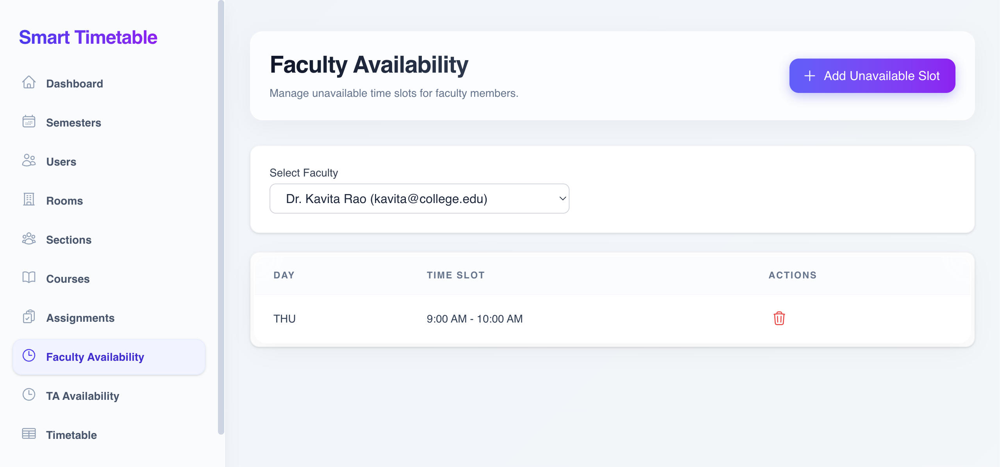
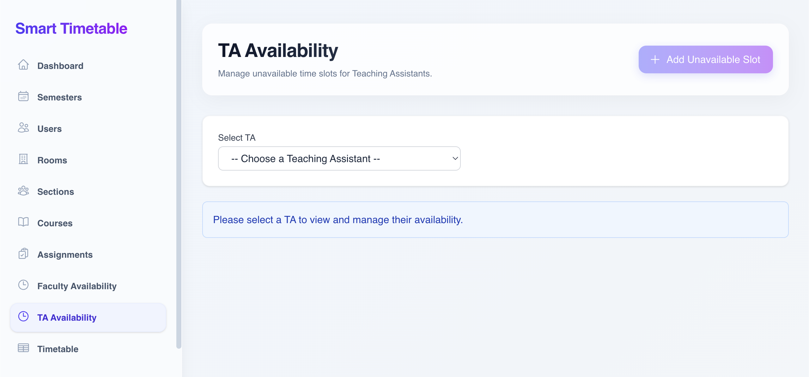
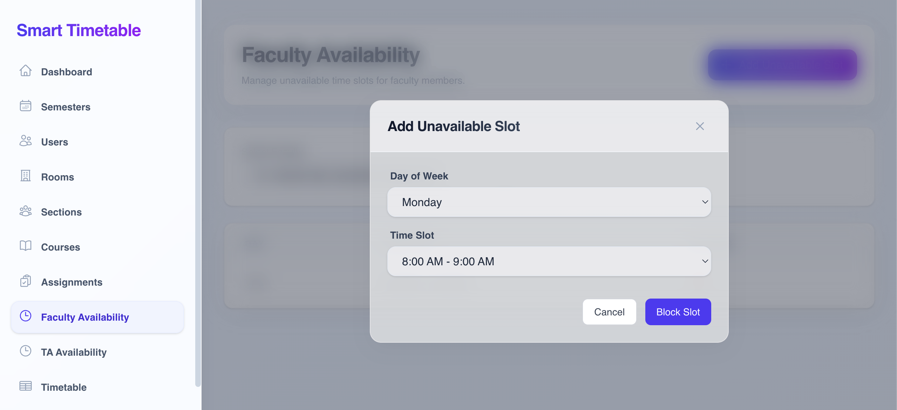

### Automatic Timetable Generation
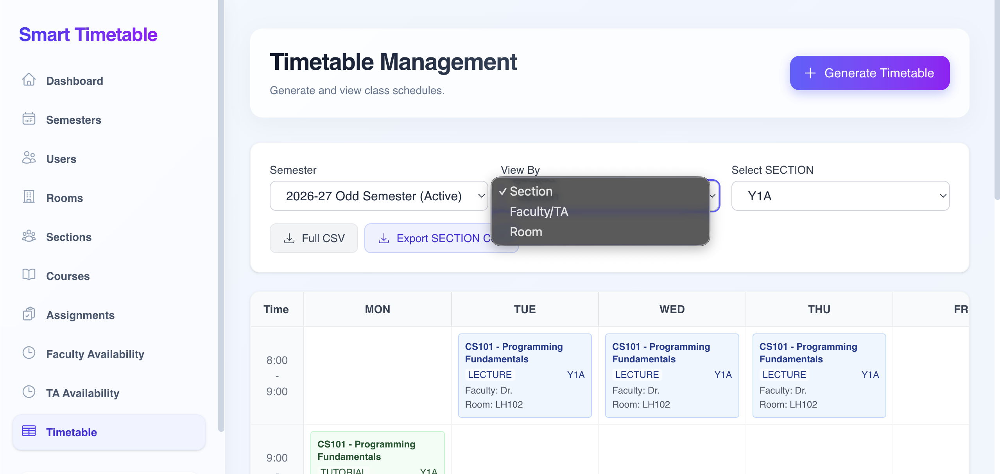

</details>

---

## Features

- **Authentication**: Secure Admin Login.
- **Semester Management**: Create, activate, and safely delete inactive academic terms.
- **User Management**: Manage Faculty and Teaching Assistants with safe deletion and active/inactive toggles.
- **Room Management**: Manage Lecture halls and Laboratories along with their seating capacities.
- **Section Management**: Organize student cohorts (e.g., Year 1, Year 2).
- **Course Management (Tier-based)**:
  - **Tier 1**: 3 Lectures + 1 Tutorial + 1 Practical
  - **Tier 2**: 3 Lectures + 1 Tutorial
  - **Tier 3**: 4 Hour Laboratory
  - **Tier 4**: 2 Hour Laboratory
- **Course Assignments**: Map Courses to Sections, Faculty, and TAs.
- **Availability Tracking**: Manage specific unavailable time slots for both Faculty and TAs.
- **Automatic Timetable Generation**: Constraint-based engine generates conflict-free schedules.
- **Dynamic Timetable Views**: View generated schedules by Section, Faculty/TA, or Room.
- **CSV Export**: One-click export for tailored schedules.
- **Conflict Reporting**: Visual feedback on scheduling bottlenecks.

---

## Architecture & Project Structure

```text
+-------------------+       REST API       +-------------------+
|                   |  (JSON over HTTP)    |                   |
|   React + Vite    | <==================> |      FastAPI      |
|   (Frontend)      |                      |    (Backend)      |
|                   |                      |                   |
+--------+----------+                      +--------+----------+
         |                                          |
         | TailwindCSS                              | SQLAlchemy (ORM)
         | Context API                              | Alembic (Migrations)
         v                                          v
+-------------------+                      +-------------------+
|                   |                      |                   |
|   Glassmorphism   |                      |  SQLite Database  |
|        UI         |                      |                   |
+-------------------+                      +-------------------+
                                                    ^
                                                    |
                                           +-------------------+
                                           | Scheduling Engine |
                                           | (Constraint-based)|
                                           +-------------------+
```

---

## Technology Stack

| Frontend | Backend | Database & Tools |
|----------|---------|------------------|
| React (Vite) | FastAPI | SQLite |
| TypeScript | Python 3.12+ | SQLAlchemy (ORM) |
| TailwindCSS | Pydantic | Alembic (Migrations) |
| Heroicons | Uvicorn | Git |

---

## Installation & Setup

### 1. Database Setup
The system uses SQLite by default, which requires no separate installation. The database file will be generated automatically in the backend directory.

### 2. Backend Setup
Navigate to the `backend` directory and set up the Python environment:
```bash
cd backend
python -m venv .venv
source .venv/bin/activate  # On Windows: .venv\Scripts\activate
pip install -r requirements.txt
```

### 3. Environment Variables
Create a `.env` file in the `backend` directory:
```env
DATABASE_URL=sqlite+aiosqlite:///./timetable.db
SECRET_KEY=your_super_secret_key_here
```

Create a `.env` file in the `frontend` directory:
```env
VITE_API_URL=http://localhost:8000/api/v1
```

### Running the Project

**Start the Backend Database & Server:**
```bash
cd backend
alembic upgrade head      # Run migrations
uvicorn app.main:app --reload
```

**Start the Frontend:**
```bash
cd frontend
npm install
npm run dev
```
*App is now running at `http://localhost:5173`.*

### 5. First-Time Setup (Creating the Admin Account)
Because this project does not hardcode default passwords, you will need to insert the first Admin user directly into the SQLite database.

1. Open the SQLite database:
   ```bash
   sqlite3 backend/timetable.db
   ```
2. Insert the admin user (password is `admin123`):
   ```sql
   INSERT INTO users (id, email, hashed_password, full_name, role, is_active, created_at, updated_at) 
   VALUES (
       lower(hex(randomblob(16))), 
       'admin@college.edu', 
       '$2b$12$EixZaYVK1fsbw1ZfbX3OXePaWxn96p36WQoeG6Lruj3vjIQqiRQYq', 
       'Super Admin', 
       'ADMIN', 
       1, 
       CURRENT_TIMESTAMP, 
       CURRENT_TIMESTAMP
   );
   ```
3. You can now log into the frontend using:
   - **Email:** `admin@college.edu`
   - **Password:** `admin123`

---

## API Documentation

Once the backend is running, the **Swagger API Documentation** is automatically generated by FastAPI.
- Navigate to `http://localhost:8000/docs` to view the interactive API docs.
- Use it to test endpoints, view JSON schemas, and understand the routing structure.

---

## How to Use (Complete Workflow)

1. **Login**: Authenticate as the Admin.
2. **Setup Academic Context**: 
   - Create and activate a new **Semester**.
   - Add **Rooms** (Lectures & Labs).
   - Add **Users** (Faculty & TAs).
   - Define student **Sections**.
3. **Define Curriculum**: Create **Courses** using the specific Tier system.
4. **Map Assignments**: Bind Courses to Sections, Faculty, and TAs in the **Course Assignments** tab.
5. **Set Availability**: Mark specific days/times as unavailable for certain Faculty or TAs.
6. **Generate**: Navigate to **Timetable**, select your active semester, and click `Generate Timetable`. The engine will calculate and render the schedule.
7. **Export**: Use the `Export CSV` buttons to download full or filtered schedules.

---

## Scheduling Constraints

The custom scheduling engine automatically resolves the following constraints:
- **Resource Availability**: Faculty, TAs, and Rooms must be available (checking individual unavailability slots).
- **Room Compatibility**: Lecture halls for lectures/tutorials; Labs for practical sessions.
- **No Overlaps**: Strict prevention of overlapping schedules for Faculty, TAs, Sections, and Rooms.
- **Duration Enforcement**: 
  - Lectures/Tutorials = 1 Hour
  - Labs = 2 or 4 Hours depending on Tier
- **Lunch Break**: Universally enforced from **12:00 PM to 1:00 PM**.
- **Role Isolation**: 
  - Tutorials display only the TA.
  - Lectures display only the Faculty.
  - Labs receive both Faculty and TA presence.

---

## Future Improvements
- Multi-user authentication (Faculty login to view personal schedules).
- Drag-and-drop manual timetable adjustments after generation.
- Email notifications for timetable publications.
- Advanced genetic algorithm for multi-variable optimization.

## Known Limitations
- Modifying assignments after a timetable is generated requires a full re-generation of the semester's schedule.
- SQLite is sufficient for localized usage but should be migrated to PostgreSQL for high-concurrency production deployments.


## Contributors
- **Lakshya Sachdeva** - *Initial Work & Full Stack Development*

## License
This project is licensed under the MIT License - see the LICENSE file for details.
